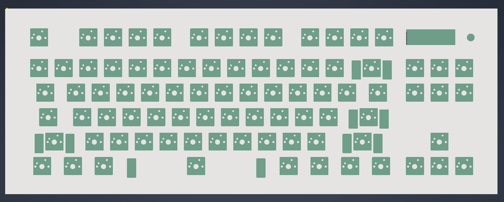
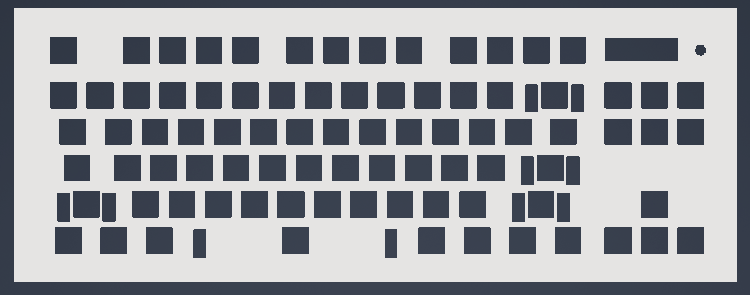
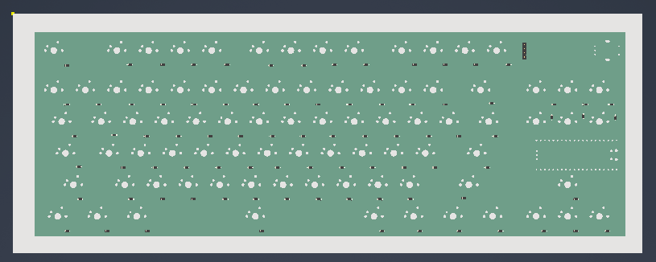
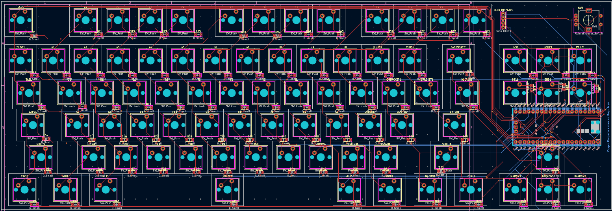

# Chester's Keyboard
A custom TKL keyboard built for the *Hack Club Blueprint program*.

It functions as a miniature media dashboard: the display shows the current track (TO BE IMPLEMENTED), the knob controls volume, and the six keys can be bound to any shortcut.

## The Hackpad

Everything fits together using 4 M3 Bolts and Heatset inserts, one in each corner. 

It has 2 separate printed pieces. The base, where the PCB sits, and the top cover, which protects the PCB.

## PCB
My PCB was designed in KiCad. The rPi Pico is mounted on the bottom of the PCB between the home keys and arrow keys to make it as compact as possible.

Schematic:

PCB:

## BOM:
- 1x Case 
- 1x [Raspberry Pi Pico 2W](https://www.adafruit.com/pico?src=raspberrypi)
- 1x [0.91" 128x32 OLED Display](https://www.addicore.com/products/oled-display-128x32-0-91in-monochrome?variant=45759649120573)
- 1x [1N4148 Diodes - 100 Pack](https://www.adafruit.com/product/5099)
- 1x [EC11 Rotary Encoder](https://www.aliexpress.us/item/3256805924910339.html)
- 1x PCB (gerber files in pcb/)
- 89x [Cherry MX Switches](https://a.co/d/hjQgWfm)
- 89x [Keycaps](https://mechanicalkeyboards.com/products/tai-hao-104-key-pbt-double-shot-keycap-set-dark-greyblack)
- 1x [Keycap Stabilizers pack](https://divinikey.com/products/aeboards-staebies-v2-stabilizers?variant=40005101355073)
- 1x [Adafruit MCP23017 I2C GPIO Expander Breakout](https://www.adafruit.com/product/5346)
- 4x M3x5x4 Heatset inserts
- 4x M3x16mm SHCS Bolts